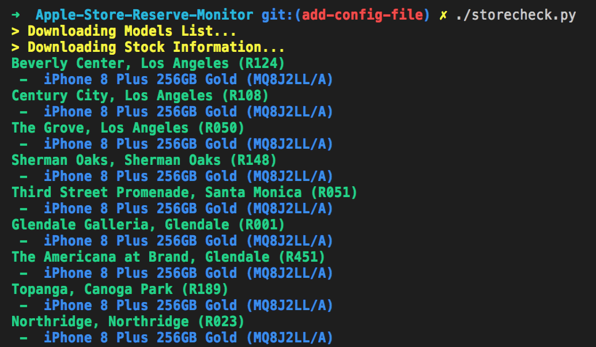
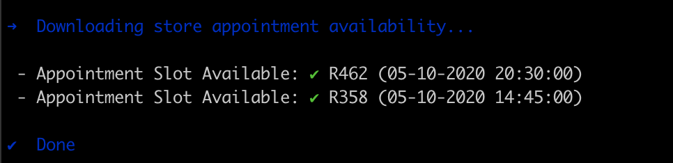

# Apple Store Reserve Monitor

- import code from another repository
- credit by https://github.com/insanoid/Apple-Store-Reserve-Monitor
- edit few parameters used in 2021
- add telegram bot support

## Supports all iPhone, iPad, and Apple Watch
#### Including iPhone 11 Pro, iPhone 11, iPad 11 Pro, iPad Air 2019
#### Now also check appointment availability due to COVID-19 store entry restrictions

- A script to monitor status of the iPhone/iPad/Watch availability in a given country.
- Configuration file to filter by country, device type, models number, carriers, and stores.
- Makes an audio announcement if there is a change in the stock for given configuration.

### Configuration (Config.json)

The configuration file has the following variables:

1. _country_code_ - ISO code for country (2 character) _(required)_
2. _device_family_ - Filter the device by the apple device family name. _(required)_

| Device Family Names |
|---------------------|
| iphone13pro |

3. _zip_code_ - ZIP code to search for (e.g. 90210) _(required)_
4. _models_ - List the models you are interested about, it does a partial match so country specific information can be stripped (`MQ8J2LL/A`, `MQ8J2`). The default value is all available models.
5. _carriers_ - Carriers you are interested in. US carriers - `TMOBILE/US`, `SPRINT/US`, `ATT/US`, `VERIZON/US`, `UNLOCKED/US`. If you are outside US do not put this in.
6. _stores_ - ID of the stores you are interested in (you will have to run the script once to get the store ID), default value is all the stores in that region (also available [here](https://gist.github.com/iF2007/ff127f7722af91c47c0cb44d6c1e961d).)
7. appointment_stores -  ID of the stores you want to look for appointments in. This is optional, if you do not put this configuration the app will not look for appointments. In COVID-19 times appointments have become a hassle to get (at least in Berlin).

**To get store's ID, model number, and carrier names you will have to run the script once.**

### Apple Watch

To monitor Apple Watch skip family name parameter and just enter the particular model number. An example configuration would be.

```
{
  "country_code": "us",
  "zip_code": "90210",
  "models": ["MU642LL/A"],
  "stores": ["R462"],
  "appointment_stores": ["R462"],
}
```

You can get the correct model number for the device you are looking for from the URL such as
`https://www.apple.com/shop/buy-watch/apple-watch/silver-aluminum-white-sport-band?preSelect=false&product=MU642LL/A&step=detail#`
the `product` value is the model number, here are a few examples:

- Apple Watch Space Gray Aluminum Case with Sport Band (MWT52LL/A)
- Apple Watch Gold Stainless Steel Case with Sport Loop (MWQN2LL/A)

Thanks to [@rovingrob](https://twitter.com/rovingrob) for pointing this out!

### How To Run:

- Ensure you have Python 3.6 and run `pip install -r requirements.txt`.
- Execute `./store_checker.py` to run once.
- Execute `./monitor.py` to keep running it every 30 seconds.




### Model Numbers (US)

- These are some model numbers but others can be found easily at third party sellers.
- Keep in mind these are country specific but you can truncate the information to skip the country information.
- To get the exact model code for your country go to your country equivalent of https://www.apple.com/de/shop/product-locator-meta?family=iphone12mini and get the `partNumber`.

| Family Name | Product Name                                    | Carrier     | Model Number |
|-------------|-------------------------------------------------|-------------|--------------|
| iphone13pro| https://www.theiphonewiki.com/wiki/Models (get model from here and add ZD/A at the end for DE and LL/A for US - see above for different countries)                                                |             |              |


### Dev Notes

Project uses the following tools to ensure a well formatted code.
However, as of now it does not have pre-commit hooks or a setup file to run the tools.
- Black (`black .`)
- Pycodestyle (`pycodestyle .`)
- Isort (`isort -y`)
